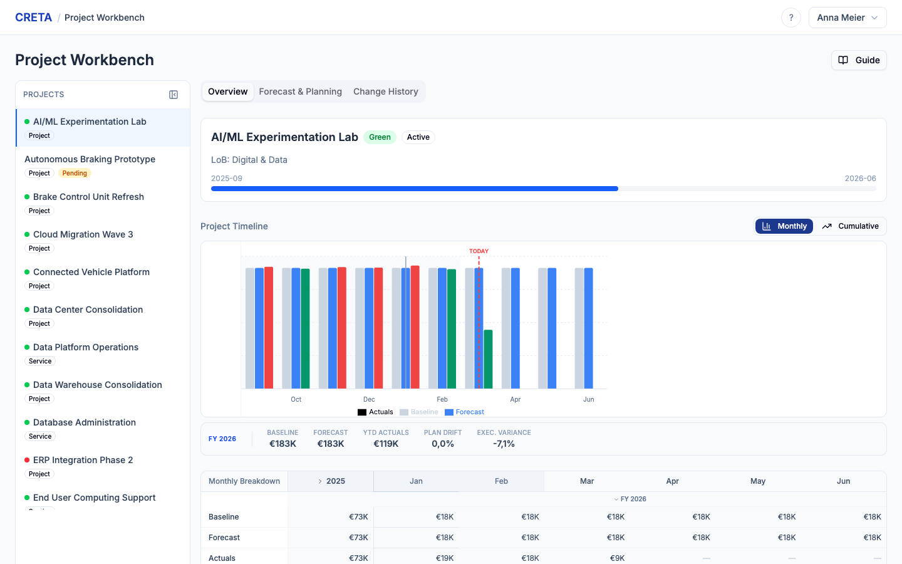

# CRETA

**Controlling, Reporting, Estimation, Tracking & Allocations**

A full-featured IT financial planning and portfolio management demo application built for Knorr-Bremse, replacing the legacy CaPa tool. CRETA provides end-to-end project portfolio visibility, capacity management, what-if scenario planning, and multi-dimensional reporting — all in a modern web interface.

> This is a **demo application** with realistic mock data. It is not connected to any production database.

---

## Screenshots

<p align="center">
  
  <br><em>Launchpad — personalized hub with module tiles and pending actions</em>
</p>

<p align="center">
  
  <br><em>Portfolio Overview — KPI dashboard, filterable project tree, and charts</em>
</p>

<p align="center">
  
  <br><em>Project Workbench — master-detail view with timeline, forecast grid, and change history</em>
</p>

---

## Features

### Launchpad
Personalised home page with role-aware content. **v5.1 Wave 6 (C-01):** Three-zone layout — **Zone 1** header (greeting + role badge + current date + Q{n} {year} forecast cycle badge), **Zone 2** horizontal pending-actions strip (urgent-first sort with red accent / triangle icon, Show/Hide toggle, "All caught up" empty state), **Zone 3** **fixed 3-column module-card grid** (replaces the v5 KPI tile grid) — Controller 9 cards / PL 8 / CC Owner 7 / Executive 6. Each card shows a Lucide icon, module name, one-line description, and 1–2 role-differentiated subtitle KPIs computed live and served via `GET /api/modules` (`subtitle_kpis: string[]`). Cards inaccessible to the current role are hidden entirely (not greyed). Click navigates to the corresponding module route.

### Portfolio Overview
IT portfolio dashboard with KPI tiles (CY-scoped to current fiscal year), hierarchical project tree grouped by configurable organizational hierarchy (e.g., Line of Business → Program → Project), budget/forecast/actuals tracking, RAG status indicators, **v5 ranked backlog with cutoff-line walk** (compose budget envelope, project type 1/2/3 driving cutoff exemption, real-time within-cutoff flag), change request approvals, and controller review with editable grids and diff comparison views. **v5 intake replaces the v4 intake queue**: new projects land at DoI 0 in the ranked backlog; controller actions (approve / send back / reject) and PL Send-Back ↔ Resubmit cycle drive lifecycle transitions. **v5 Cluster E (Session E2 backend):** portfolio-wide external cost aggregation — vendor summary across projects (top project per vendor, project count), category analysis with `pct_of_external_total`, and a project-vendor cross-tab matrix (rows = projects, columns = vendors).

**v5 Cluster F + E (Sessions F7 + E5 + E6 frontend, Wave 5):** Portfolio module split into two sibling sub-modules per `[E-11]` via a top-level pill switcher (last selection persisted): **Change Portfolio** (DoI 0–4 transformation projects with the existing dashboards, tabs, and tree) and **Run Portfolio** (DoI 5 / Offerings / Internal Services). Run Portfolio surfaces 4 KPIs (total annual cost, To-Business vs internal split, mix by entity type, outsourcing ratio), 3 dimension rollup panels (region / division / country), and a type-filtered entity list with drill-down to `/workbench?entity={id}&type={offering|internal_service}` opening a slim **EntityWorkspace** (BTC tab as primary). New **External Spend** tab on the Change sub-module (cross-project vendor summary + expandable per-project breakdown + category analysis + project × vendor matrix). Project clicks now open a **full-page detail view** at `/portfolio/project/{id}` (replaces the v4 slide-in panel) with hierarchy breadcrumb + 4-tab shell (Overview / Financial Detail / Resources & Costs / History), all read-only for every role.

### Backlog
Ranked IT project backlog with composite scoring, cutoff analysis, and Tech Navigator cube view per `[A-BK-01..26]`. **Ranked List view** — sortable table (rank, project name, composite score, budget) with server-driven stage/type/size/T-level filters and within-cutoff toggle. Cutoff bands inserted at `should_be_cutoff_rank` and `reality_cutoff_rank`; misalignment-zone rows tinted amber. Sort override suppresses bands and shows a reset banner. **Cube view** — 3-column scatter chart grid (T0 Just better / T1 Paper to software / T2 New business) with bubble size proportional to budget, colored by project type. **CutoffSummaryStrip** — always-visible portfolio-wide budget envelope KPIs. **Project detail** (`/backlog/:projectId`) — 4-tab view: Scores & Ranking (Tech Navigator rubric + ranking context card), Financial Overview (embedded workbench overview), Master Data (DoI-aware completeness checklist), Milestones (read-only strip + table). URL search params persist all filter, sort, view-mode, and tab state.

### Tech Navigator Scoring
Per-project scoring rubric (Complexity sub-criteria: Standardization 40 % / Usage 40 % / Maintenance 20 %; Value Creation sub-criteria: Financial benefit 50 % / Payback 40 % / Competitive advantage 10 %) with 1–5 scale and descriptive labels. Project Type (1/2/3) and Transformation Level (T0/T1/T2) selectors. Real-time computed Complexity / Value Creation / Composite Ranking (Value 70 % · Complexity 30 %) plus admin-configurable budget t-shirt size (XS/S/M/L/XL with editable thresholds). Ranking engine consumes composite score for the cutoff-line walk.

### Project Workbench
Master-detail project workspace with sidebar project list showing type and status badges (color-coded: amber for workflow statuses, neutral for Active/Completed/Planned). Five tabs: Overview, Forecast & Planning, Cost Allocation (or Distribution), External Costs, and Change History. Includes a 5-phase rolling forecast wizard with AI-generated suggestions, a full project submission workflow with resource planning, CC Owner confirmation, and controller change request review. Auto-allocation ensures every internal resource line has assigned employees whose hours match the forecast — triggered on project approval and CR acceptance.

**v5 Cluster E (Sessions E3 + E4 frontend, Wave 5):** Overview tab is now a **3×3 action-card tile grid** of nine tiles per `[E-04a..d]`: Project Header, Three-Point Summary (click → variance waterfall dialog), Milestone Status, Resource Plan, Cost Mix (CapEx/OpEx donut + internal/external split), Progress Tracker (click → Progress vs. Burn dialog) with diamond confidence indicator, External Costs (with category bar chart), Forecast Health (current cycle + version chip + on-track badge), and Tech Navigator. The F6 BTC allocation tile is rendered as a full-width band below the grid per `[E-09]` coexistence. **Progress vs. Burn chart** (`[E-05a..d]`) renders cumulative progress + budget consumed + baseline burn lines with milestone zone bands and solid/highlighted/dashed milestone markers; falls back to burn-only when no progress data. **Variance Waterfall chart** (`[E-05c]`) bridges baseline → grouped CR categories → current forecast with bar-click navigation into CR detail.

**v5 Cluster E (Session E5 frontend, Wave 5):** New **External Costs** tab — KPI strip (forecast / actuals YTD / open POs / variance vs baseline) + sortable category breakdown (click to filter vendor list) + sortable expandable vendor table (per-vendor row expansion shows baseline / lines / consumed % / variance vs baseline).

### Capacity Management
Team utilization heatmaps (CSS grid, person x month), cell-level drill-down showing allocated/available hours with person-level detail, organization-wide overview with 3 pivot views (Cost Center, Role, top-level entity), and resource request management with assignment preview. **v5 Cluster E (Session E2 backend):** PL-friendly **role availability** read-model aggregated by `(role_type, location, month)` with no person identifiers in the response — surfaced via `GET /api/capacity/role-availability` and consumed by the new PL Resource Availability tile on the Launchpad.

### What-If Simulator
Scenario planning tool with 12 v4 action types (7 project-level, 5 portfolio-level), real-time KPI impact calculation, year-scoped actions, multi-scenario comparison, portfolio drill-down, and an AI Advisor panel with optimization recommendations.

**v5 Cluster B (B1 backend, merged):** Scenarios anchor to a specific `ForecastVersion`; manual rebase to newer cycles. Soft archive (read-only, hidden from active list, clonable). Free-text tags with multi-select filter. Tier 3 content gating on publish (defaults to "tier3_only" visibility when scenario contains people / rate-table / capacity-param / restructuring diffs). **Lever 12 sandbox engine** mutates Stage 1 distribution edges (forked into `version='scenario-{id}'`) and Stage 2 BTC profile / `to_business_pct` overlays without touching live `BTCProfile` rows; `GET /lever12/cost-allocation-impact` returns per-charging-location deltas. **8-dimension impact dashboard** (financial / backlog_ranking / capacity / people [Tier 3 redacted] / outsourcing_ratio / investment_mix / running_cost / change_summary + cost_allocation widening). **Promote workflow** (controller-only) routes each diff through its native system path (forecast_grid → direct/CR, pipeline_stage → DoI gate, tech_navigator → direct/send-back, rate_table → admin path, people → action item, cost_allocation → direct mutation gated by per-entity-type RolePermissionGrant per `[F-AC-01]`). **PL Apply-to-forecast** carries own-project diffs into the next cycle with `is_provisional=True` provenance markers. CC Owner scenarios auto-scope to managed cost centre per `[E-06b]`.

**v5 Cluster B (B2 frontend, T1 slice):** Wholesale rebuild of the frontend simulator at `/simulator/*` via `SimulatorRouter`. New `ScenarioContext` provides the full B1 mutation surface to surfaces, the catalogue, the impact dashboard, and the change-summary drawer. The Scenario Manager surfaces visibility (Private / Tier 3 / Published) with badges, tag filters, archive toggle, rebase, clone, and publish/unpublish. Workspace is a 3-zone shell (sidebar + impact strip + surface) wrapped in an amber sandbox border that visually separates scenario edits from canonical Workbench / Charging surfaces. Sandbox writes are routed through the `'scenario-{id}'` version string per `[F-S1-04]` and never touch live data. Apply-to-forecast modal (PL-only) surfaces carried/skipped counts and the `is_provisional` provenance note. Permissions: `useTier3` reads `RoleContext.tier3_flag` (resolved server-side from `User.tier3_flag` per `[D-AC-02]`), `useCanPromote` is controller-only, `useCanApplyToForecast` is PL-only, `useCanCreateScenario` excludes PL per `[E-06c]`. AI Advisor (v4) is preserved verbatim and gated behind `VITE_ENABLE_AI_ADVISOR`. T2 / T3 / T4 fill surfaces, impact dashboard, compare view, catalogue, and promote workflow on top of T1's shell.

The `GET /api/roles/{role_id}/context` response now includes `tier3_flag: bool` (resolved from `User.tier3_flag` looked up by `person_id`; defaults to `false` when no active User row exists). This is the single backend change in B2.

### Reporting
Five standard reports — Programme Rollup, Cost Center Financial Summary, Vendor Spend Analysis, Forecast Accuracy, and Year-over-Year Comparison. Features include custom project groupings, column configuration, saved views, and export capabilities.

### Interactive Report Builder
Click-to-build OLAP-style report builder with a data catalog of 18 dimensions and 16 measures. Drag dimensions into Rows, Columns, and Filters zones; add measures to Values. Cross-tabulation renderer with nested column headers (e.g., Fiscal Year > Measure Name), collapsible row groups with subtotals, grand totals, sticky headers, column sorting, and conditional formatting with RAG presets. Calculated measures with two-operand formulas. Four chart views (Table, Bar, Line, Pie). Save, load, and share reports with permission controls. Publish to Report Library for team access. CSV export with metadata, subtotals, and grand totals.

### AI Report Builder
Natural language report generation powered by Claude. Describe any report in plain English through a guided chat interface — the AI queries the database, generates tables, charts (bar, line, pie), and KPI summary cards. Supports iterative refinement through follow-up messages. Requires an Anthropic API key (configurable in Administration > Planning Parameters > Integrations).

### Dark Mode
Full dark mode support with a Sun/Moon toggle in the top bar. Theme preference persists in localStorage and respects system preferences. All 141 components use semantic CSS variables for seamless light/dark switching. Charts, status badges, and heatmaps are all dark-mode aware.

### Cross-Module Visual Consistency (v5 Session E8)
Shared visual vocabulary across the 10 modules per `[E-07a..g]` and `[F-MD-01]`. Single `ModuleHeader` (title + subtitle + actions slot) on Portfolio / Workbench / Capacity / Charging / Admin / Reporting / Docs / Backlog / Simulator, with Launchpad's centred E7 layout and Reporting's nested builder routes preserved as deliberate exceptions. Shared `LeftRailNav` backs Charging and Admin sidebars (flat and grouped forms). Three formal card types (`SummaryCard`, shadcn `Card`, `ActionCard`) and a shared `EmptyState` pattern. Confidence indicators render as a distinct **diamond shape** (`ConfidenceIndicator`) so they stay visually separable from RAG dots when both appear on the same tile. **Location-master tooltips** (`LocationLabel`) disambiguate the three master entities — `WorkforceLocation`, `ChargingLocation`, `LegalEntity` — wherever they surface in column headers, table cells, or section titles, with a dotted-underline + info icon affordance and a one-sentence definition on hover.

### v5 Demo Seed Reconstruction (v5 Session S1)
Full seed-data reconstruction per `[F-DG-01..03]`. New `backend/seed/generate_seed_v5/` package replaces the v4 `generate_seed/` package. Demo expresses the polymorphic `ChargeableEntity` model end-to-end: 11 projects (incl. 2 Run-stage at DoI 5) + 6 offerings + 17 internal services = 34 entities total. 39 Stage 1 distribution edges with one explicit multi-step path (`svc-infra-platform` → `svc-data-platform` → `off-bizinsights` → To-Business), self-retained residual on two services, and full upstream/downstream chain on the demo flagship (Master Data Hub, S042). 27 BTC profiles (15 manual + 12 automatic with S-code linkage) including year-rollover demo (2025 + 2026 profiles for two entities). 312 UM-matrix cells across 12 S-codes × 2 quarters. 90 charging locations + 120 legal entities + 28 countries + 3 regions seeded as master data with fictionalisation per `[F-DG-02]`. Tech Navigator scoring populated for 9 projects; pipeline stage + DoI for all 11. 2,353 baselines + 1,889 forecasts + 945 actuals + 1,179 polymorphic allocations. 7 change requests across 4 workflow states. 31 milestones + 21 deliverable checklist items + 9 historical progress snapshots. 3 What-If scenarios including a controller-private lever-12 BTC rebalance on the demo flagship and a published cross-portfolio scenario. 4 workflow templates with their step + action shape per `[D-CAT-07]`. 19 persona-differentiated notifications + 4 system suggestions + role-permission grants per `[F-AC-01]`. v5 `validate.py` ports the v4 rules + adds two v5-specific rules (distribution sum, BTC sum) — 9/10 rules pass against the seeded DB.

### Charging & Allocations (Cluster F)
Two-stage IT cost charging cycle. **Polymorphic ChargeableEntity** (Project / Offering / InternalService) is the cost-allocation root, replacing project-only allocations. **Stage 1 inter-service distribution edges** with sparse storage, sum-rule validation (`to_business_pct + Σ(distribute %) ≤ 100`), DAG resolution for effective costs (own + Σ inflows), cycle detection with chain returned in error body, and versioning along the standard baseline / forecast / actuals lifecycle. WBS Element generation is algorithmic in format `<identifier>-64-99-<charging_location_code>`. Master data adds Charging Locations (~90 KB charging codes), Legal Entities (~120 with rollup), Regions, Countries, and the User Measurement matrix viewer (sparse 99×90 S-code × charging-code grid with CSV upload + stubbed automatic-refresh per the integration boundary).

**Frontend module (v5 Sessions F4 + F5):** Top-level "Charging & Allocations" module placed after Portfolio in the navigation per `[E-10]`. Sidebar pattern matching the admin module, four primary surfaces:
- **Inter-service Distribution editor:** cross-entity browse + filter, per-entity edges-as-list editor with `to_business_pct` field, sum-cap pre-check, derived self-retained %, cycle-chain rendering on 409 per `[F-S1-03..05]`.
- **BTC Profiles editor:** cross-entity list with sums-to-100 indicator; single-entity manual mode (add-only line list, charging-location picker filterable by region/division, sum-to-100 gate per `[F-S2-02]`); automatic mode with read-only preview, "Refresh from UM" diff dialog before commit per `[F-S2-04]`; mode change with values-visible warning per `[F-S2-05]`; "New profile" supports manual / automatic / copy-from per `[F-S2-07]`.
- **Location Cost Rollup:** static SVG world map with bubbles at country level (size = magnitude, color = dominant division) and click-to-drill into the country's charging-locations per `[F-RV-03]`; clicking a location bubble opens a side panel with the per-location breakdown (chargeable-entity inflows + legal entities operating at the location) per `[F-RV-04]`; tree-table view with three pre-built rollup paths (Region→Country→Location, Division→Location, Country→Location), cell drill-down to contributing entities + DAG upstream chains per `[F-RV-04]`.
- **Reporting integration:** AI Report Builder bridge with Cluster F prompt templates (cost by division, top inflow drivers, regional YoY) plus a catalogue listing all 11 dimensions and 6 measures the data layer exposes per `[F-RV-01]`.

**Workbench BTC tile + tab (v5 Session F6, [E-09]):** Project Workbench gains a BTC allocation tile in the Overview tab (headline business € amount, top 3 charging locations with % bars, "+N more" CTA into the BTC tab) and a new third tab "Cost Allocation" (or "Distribution" when the entity has zero To-Business share). The tab embeds the refactored single-entity BTC profile editor (now accepts `entityId + year`), a sortable allocation breakdown table with click-to-drill into upstream-cost paths, and per-entity audit history. Internal services with no business charging fall back to the entity-keyed Distribution editor inline.

### Administration
Five-section sidebar navigation (Master Data → Reference Catalogues → Planning & Ranking → Portfolio Hierarchy → System) covering 24 admin sub-surfaces. Master data: Cost Centers, Competence Centers, Lines of Business, Workforce Locations, People, plus Cluster F's Charging Locations / Legal Entities / Regions / Countries / User Measurement. Reference catalogues: Role Types, External Cost Types, Project Dependencies. System: Users (with Tier 3 + change-reviewer flags), Role Permissions Grid (per-role per-entity-type grants for BTC profile + Stage 1 distribution edits + master-data overrides), Rate Tables, **Workflow Templates editor** (six configurable workflows — forecast cycle, intake, change request, send back, milestone baseline override, scheduled master data activation; per-step touchpoint editor for required / skippable / assigned role / data gates / notifications JSON / time constraint / escalation), **Scheduled Changes panel** (5-state lifecycle pending_review → approved → activated / rejected / cancelled with manual-trigger activation engine), and **Audit Log V2** (8-category filter, entity-scoped trail, CSV + Excel export). Dark-mode-ready throughout; all-controller demo.

---

## Quick Start

### Prerequisites

| Tool | Version | Install |
|------|---------|---------|
| Python | 3.12+ | `brew install python@3.12` or [python.org](https://python.org) |
| Node.js | 20 LTS+ | [nodejs.org](https://nodejs.org) |

### Setup

```bash
git clone https://github.com/bill-pap/vision-demo-prototype.git
cd vision-demo-prototype

# Backend
cd backend
python3.12 -m venv .venv
.venv/bin/pip install -r requirements.txt

# Frontend
cd ../frontend
npm install
```

### Run

```bash
./start.sh
```

This starts both servers, resets demo data, and opens the app at **http://localhost:5173**.

See [SETUP.md](SETUP.md) for manual start instructions, troubleshooting, and detailed configuration.

---

## Demo Personas

Four personas are available via the role switcher in the top-right corner:

| Persona | Role | Key Access |
|---------|------|------------|
| **Anna Meier** | Controller | Full access — all modules, admin, approvals, scenarios |
| **Thomas Brenner** | CC Owner | Capacity management, portfolio dashboard |
| **Priya Sharma** | Project Lead | Project workbench, forecast cycles, intake submission |
| **Thomas Becker** | Executive | Portfolio dashboard, scenarios (read-only) |

---

## Tech Stack

| Layer | Technology |
|-------|-----------|
| **Backend** | Python 3.12, FastAPI, SQLAlchemy ORM, Pydantic |
| **Frontend** | React, TypeScript, Vite, Tailwind CSS |
| **UI Components** | shadcn/ui (Radix UI primitives) |
| **Charts** | Recharts |
| **Database** | SQLite (embedded, demo) |
| **Font** | Inter |

---

## Project Structure

```
vision-demo-prototype/
├── backend/              # FastAPI API (90+ endpoints across 9 routers)
│   ├── models/           # SQLAlchemy ORM models
│   ├── routers/          # Route handlers
│   ├── schemas/          # Pydantic request/response schemas
│   └── seed/             # seed.sql + JSON fixtures
├── frontend/             # React SPA
│   ├── src/modules/      # 7 module UIs
│   ├── src/components/   # Shared components (layout, ui, charts)
│   └── src/contexts/     # React contexts (Role, SidePanel, BottomDrawer)
├── qa/                   # Quality assurance
│   └── test-plan.md      # E2E regression test plan (138 scenarios)
├── docs/                 # Documentation assets
├── start.sh              # One-command launcher
├── SETUP.md              # Detailed setup guide
└── PROGRESS.md           # Build progress tracker
```

---

## API Documentation

The backend serves interactive API documentation via Swagger UI at **http://localhost:8000/docs** when the server is running.

The app also includes a built-in Documentation Hub at `/docs` with six tabs: Overview, Module Guides (10 manuals incl. Backlog and Charging & Allocations), API Reference (live OpenAPI groupings), Data Model (entity reference grouped by cluster, refreshed for the v5 polymorphic ChargeableEntity + configurable hierarchy redesign), FAQ (40+ entries, role-filtered), and **Changelog** (v5 release notes for demo storytelling).

### Key API Groups

| Router | Prefix | Endpoints | Description |
|--------|--------|-----------|-------------|
| **Launchpad** | `/api` | 8 | Roles, modules (with role-differentiated subtitle KPIs per W6 [C-01]), KPIs, pending actions, project create/submit |
| **Portfolio** | `/api/portfolio` | 21 | Dashboard KPIs, project tree, intake queue (approve/reject/send-back/diff/accept-changes), CR approvals (approve/reject/send-back/editable-grid), external cost vendor / category / project-vendor matrix (E2) |
| **Workbench** | `/api/projects`, `/api/workbench` | 20 | Project list, overview, timeline, forecast grid (v4), mixed-granularity grid (C1), 5-phase forecast cycle, CR diff/accept-changes/resubmit, forecast version history + diff, per-project external cost vendor / category rollup (E2) |
| **Forecast Versions** | `/api/forecast` | 1 | Cross-project version diff (C1) |
| **Tech Navigator** | `/api/projects` | 2 | Project Tech Navigator profile (read + partial update with score recompute) |
| **Pipeline** | `/api/projects` | 4 | Pipeline stage + DoI gate state (read, transition with optional override, AI Council flag, manual within_cutoff setter) |
| **Project Milestones** | `/api/projects` | 4 | Milestone CRUD (list, create, update, delete) per project; baseline-date edits require controller + override reason per [A-MS-03] |
| **Capacity** | `/api/capacity` | 15 | Team heatmap, drill-down, resource requests, per-month assignments, org overview, project confirmation, role × location × month availability (E2) |
| **Scenarios** | `/api/scenarios` | 28 | CRUD, actions, comparison, AI advisor (v4) + Lever 12 sandbox (Stage 1/Stage 2/per-CL impact), 8-dimension impact dashboard, anchor + rebase + archive lifecycle, controller Promote (with [F-AC-01] gating), PL Apply-to-forecast, Tier 3 visibility (B1) |
| **Reports** | `/api/reports` | 8 | Programme rollup, CC financial, vendor spend, forecast accuracy, YoY, saved views |
| **Report Builder** | `/api/report-builder` | 12 | Data catalog, filter options, query execution, saved reports CRUD, share/publish, CSV export |
| **AI Report Builder** | `/api/reports/ai-builder` | 4 | Status check, conversation start, message, cleanup |
| **BTC Profiles + Rollup** | `/api/charging`, `/api/admin` | 20 | BTCProfile CRUD, UM refresh, mode change, copy/year-rollover, WBS matrix, rollup query (11 dims), drill-down, per-location breakdown (level-4), cache invalidate/status, F6 per-entity allocation breakdown + read-only entity / charging-locations |
| **Admin** | `/api/admin` | 20 | Entity CRUD (cost centers, CCs, grouping entities, locations, people), rates, parameters, hierarchy management, audit log, demo reset, Tech Navigator score recompute, milestone-types catalogue |
| **Docs** | `/api/docs` | 8 | Module manuals (list / detail / all), FAQ (list / detail / all), Changelog, OpenAPI proxy |
| **Reference** | `/api/reference` | 4 | Roles, cost types, grouping entities, cost centers |

### Submission Workflow Endpoints

The project submission lifecycle (`draft` -> `pending_cc_confirmation` -> `pending_approval` -> `active` / `changes_requested`) is powered by:

| Method | Path | Purpose |
|--------|------|---------|
| `POST` | `/api/projects` | Create draft project with optional resource plan |
| `PUT` | `/api/projects/{id}/submit` | Submit draft for CC confirmation |
| `GET` | `/api/projects/{id}/resource-plan` | Get forecast data for resource plan editor |
| `PUT` | `/api/portfolio/intake/{id}/approve` | Controller approves project |
| `PUT` | `/api/portfolio/intake/{id}/reject` | Controller rejects project |
| `PUT` | `/api/portfolio/intake/{id}/send-back` | Controller requests changes with editable grid |
| `GET` | `/api/portfolio/intake/{id}/diff` | Get original vs proposed comparison grid |
| `PUT` | `/api/portfolio/intake/{id}/accept-changes` | PL accepts controller's proposed changes |
| `GET` | `/api/portfolio/intake/{id}/editable-grid` | Get forecast in editable format (controller) |
| `PUT` | `/api/portfolio/intake/{id}/resubmit` | PL resubmits after editing |

### Change Request Workflow Endpoints

The CR lifecycle (`pending_controller_approval` -> `sent_back_by_controller` -> `pending_cc_confirmation` -> `approved`) is powered by:

| Method | Path | Purpose |
|--------|------|---------|
| `PUT` | `/api/portfolio/approvals/{cr_id}/approve` | Controller approves CR (routes to CC Owner if resource changes) |
| `PUT` | `/api/portfolio/approvals/{cr_id}/reject` | Controller rejects CR |
| `PUT` | `/api/portfolio/approvals/{cr_id}/send-back` | Controller requests changes with editable grid + snapshots |
| `GET` | `/api/portfolio/approvals/{cr_id}/editable-grid` | Get forecast in editable format for controller |
| `GET` | `/api/projects/{pid}/change-requests/{cr_id}/diff` | PL views original vs controller-proposed comparison |
| `PUT` | `/api/projects/{pid}/change-requests/{cr_id}/accept-changes` | PL accepts controller's proposed changes |
| `PUT` | `/api/projects/{pid}/change-requests/{cr_id}/resubmit` | PL resubmits CR to controller |

### Forecast Grid + Versioning Endpoints (v5 Session C1)

Mixed-granularity forecast grid, immutable version snapshots, and cross-version diff. Backwards-compatible: v4 `GET /api/projects/{id}/forecast` is unchanged.

| Method | Path | Role | Purpose |
|--------|------|------|---------|
| `GET` | `/api/projects/{id}/forecast/grid` | all | Mixed-granularity grid (monthly+quarterly) [C-FG-02]. Params: `granularity`, `boundary_months`, `horizon_months` |
| `GET` | `/api/projects/{id}/forecast/versions` | all | List forecast versions newest-first [C-RH-01]. PL-filtered |
| `GET` | `/api/projects/{id}/forecast/versions/{vid}` | all | Version detail + full payload [C-RH-02] |
| `POST` | `/api/projects/{id}/forecast/versions` | controller | Manual snapshot [C-FV-03] |
| `GET` | `/api/forecast/versions/{a}/diff/{b}` | all | Diff two versions (cross-project valid) [C-RH-05] |

### Progress Tracker Endpoints (v5 Session E1)

Milestone-anchored qualitative progress tracking with optional deliverable checklist enrichment per `[E-04c]`. All fields live-editable; snapshots captured automatically at forecast cycle completion. Portfolio-level inline indicator per `[E-04d]`.

| Method | Path | Role | Purpose |
|--------|------|------|---------|
| `GET` | `/api/projects/{id}/progress` | all | Read live progress state + checklist rollup + effective percentage [E-04c] |
| `PATCH` | `/api/projects/{id}/progress` | controller / PL on own | Update narrative, confidence (+ reason for at_risk/blocked), manual pct override, current milestone [E-04c]. One audit entry per changed field; category `forecast_actions` |
| `GET` | `/api/projects/{id}/progress/history` | all | List historical snapshots newest-first |
| `GET` | `/api/projects/{id}/progress/history/{snapshot_id}` | all | Snapshot detail with captured checklist payload |
| `GET` | `/api/projects/{id}/milestones/{mid}/checklist` | all | List deliverable items for a milestone |
| `POST` | `/api/projects/{id}/milestones/{mid}/checklist` | controller / PL on own | Add deliverable item (max 10 per milestone per [E-04c]) |
| `PATCH` | `/api/projects/{id}/checklist/{item_id}` | controller / PL on own | Update item text, completion (auto-stamps `completed_at`/`completed_by_id`), or sequence |
| `DELETE` | `/api/projects/{id}/checklist/{item_id}` | controller / PL on own | Remove deliverable item |
| `GET` | `/api/portfolio/progress-aggregate` | all (PL scope-filtered) | Portfolio-wide progress indicators with confidence summary buckets [E-04d] |

When the current milestone has at least one deliverable, `effective_progress_pct` auto-computes from the completion ratio unless `progress_pct_manual_override=True` per `[E-04c]`. Confidence values are normalised to `on_track | at_risk | blocked`; `at_risk` and `blocked` reject without `confidence_reason`.

### External Cost Category Endpoints (v5 [E-08e] [E-08f])

Admin-configurable taxonomy seeded with the default demo set: Consulting, Cloud/Infrastructure, Licenses, Hardware, Other (production: SAP/Ariba). Standard CRUD per Cluster D admin browser pattern, controller-only writes, audit category `master_data`.

| Method | Path | Role | Purpose |
|--------|------|------|---------|
| `GET` | `/api/admin/external-cost-types` | controller | List external cost categories alphabetically |
| `POST` | `/api/admin/external-cost-types` | controller | Create new category (name unique, audit-logged) |
| `PUT` | `/api/admin/external-cost-types/{id}` | controller | Rename category (409 on duplicate, audit-logged) |

### Tech Navigator Endpoints (v5 Cluster A)

The Tech Navigator scoring profile (Complexity sub-criteria, Value Creation sub-criteria, Transformation level, Project Type, t-shirt size derived from budget) is editable per project; sub-criterion weights and t-shirt thresholds are admin-configurable.

| Method | Path | Purpose |
|--------|------|---------|
| `GET` | `/api/projects/{id}/tech-navigator` | Read full profile + computed scores + active weights snapshot |
| `PUT` | `/api/projects/{id}/tech-navigator` | Partial update; recomputes complexity/value/composite/tshirt in one transaction (controller or PL on own project) |
| `POST` | `/api/admin/recompute-scores` | Recompute Tech Navigator scores across the entire portfolio (controller-only) |

Admin-configurable parameters (12 rows in `param_group='tech_navigator'`): sub-criterion weights (Complexity 40/40/20, Value 50/40/10), composite ranking weights (Value 70 / Complexity 30), and t-shirt size thresholds (XS ≤100k, S ≤250k, M ≤500k, L ≤1M, XL >1M). Editing any `tn_*` key via `PUT /api/admin/parameters` automatically triggers `recompute_all_scores`.

### Pipeline Stage / DoI Endpoints (v5 Cluster A — Session A2)

Each project carries a working pipeline stage (`Proposed`, `Under Evaluation`, `Approved`, `Active`, `Hyper-maintenance`, `Operate`, `Retired`, `Paused`, `Cancelled` per `[A-PS-02]`) and a DoI level (0–5 per `[A-DOI-01]`). Off-path stages (`Paused`, `Cancelled`) carry `frozen_doi`. The AI Council screening flag and OneDrive document URL gate the DoI 0→1 transition; `within_cutoff` is settable here in A2 and recomputed by the ranking engine in A3.

| Method | Path | Purpose |
|--------|------|---------|
| `GET` | `/api/projects/{id}/pipeline` | Read full pipeline state — stage, DoI, frozen DoI, AI Council flag/URL, within_cutoff, available transitions, and gate status (missing fields for the next DoI) |
| `POST` | `/api/projects/{id}/pipeline/transition` | Move to a new stage / DoI. Controller anywhere; PL on own project for forward DoI 0→1 / 1→2. Missing gate fields → 409 unless `override_reason` is supplied (audited) |
| `PUT` | `/api/projects/{id}/pipeline/ai-council` | Controller-only setter for `ai_council_approved` + `ai_council_doc_url` (per `[A-DOI-03]`) |
| `PUT` | `/api/projects/{id}/pipeline/within-cutoff` | Controller-only manual setter; A3 replaces with the computed value driven by the envelope walk |

Stage transitions are permissive on backwards moves per `[A-PS-11]`. Cancelled → anything requires `override_reason` per `[A-PS-10]`. DoI gate validation skips backward DoI moves and off-path transitions.

### Project Milestones Endpoints (v5 Cluster A — Session A4)

Project milestones (renamed from `ProjectPhase` in v5 per `[A-MS-01]`) carry baseline + forecast date ranges, an optional `MilestoneType` reference, an optional per-milestone `color` override, and a `baseline_locked_at` timestamp set on first save. Baseline-date edits are controller-only and require an `override_reason` per `[A-MS-03]`.

| Method | Path | Purpose |
|--------|------|---------|
| `GET` | `/api/projects/{id}/milestones` | List milestones for a project (any authenticated). Empty list valid per `[A-MS-04]`. |
| `POST` | `/api/projects/{id}/milestones` | Create a milestone (controller, or PL on own project). Sets `baseline_locked_at = now`. 409 on `sequence_number` collision. |
| `PUT` | `/api/projects/{pid}/milestones/{mid}` | Partial update. Forecast-only edits open to controller / PL on own project; baseline-date edits require controller AND `override_reason` (audit-logged). |
| `DELETE` | `/api/projects/{pid}/milestones/{mid}` | Delete a milestone (controller, or PL on own project). |
| `GET` | `/api/admin/milestone-types` | Read-only catalogue of the 10 default milestone types per `[A-BK-34]`. |

The catalogue exposes `{id, name, default_color, suggested_ordering, is_active}` rows. The resolved `color` returned on milestone responses is the per-milestone override when set, otherwise `MilestoneType.default_color` for the linked type.

### Intake Workflow Endpoints (v5 Cluster A — Session A5)

Greenfield project creation lands at DoI 0 (Proposed) and the project appears immediately in the ranked backlog (composite score null). Three controller actions move the project through the pipeline; PL or controller can resubmit after a Send Back. v4 `/api/portfolio/intake*` endpoints are removed (HTTP 410 with structured replacement pointers) per `[A-PS-13]`.

| Method | Path | Auth | Purpose |
|--------|------|------|---------|
| `POST` | `/api/intake/projects` | PL / Controller / Exec | Create project at DoI 0 (Proposed) per `[A-BK-26]` / `[A-DOI-04]` |
| `GET` | `/api/intake/queue` | any role | List projects in Under Evaluation (controller review queue) per `[A-BK-26]` |
| `POST` | `/api/intake/projects/{id}/approve` | controller | Approve from Under Evaluation → Approved (DoI 3) per `[A-BK-27]` |
| `POST` | `/api/intake/projects/{id}/send-back` | controller | Send back → Proposed (DoI 1) with comments + snapshot per `[A-BK-27]` / `[A-BK-29]` |
| `POST` | `/api/intake/projects/{id}/reject` | controller | Reject → Cancelled with reason; freezes DoI per `[A-BK-27]` / `[A-PS-03]` |
| `POST` | `/api/intake/projects/{id}/resubmit` | PL on own / controller | PL revises and resubmits → Under Evaluation (DoI 2); captures `pl_resubmitted` snapshot per `[A-BK-29]` |
| `GET` | `/api/intake/projects/{id}/diff` | any role | Structured before/after diff (sent_back vs resubmit/current) per `[A-BK-29]` |

Removed v4 endpoints (return 410 Gone with `{error, message, replacements}`): `GET/PUT /api/portfolio/intake*`, `PUT /api/portfolio/intake/{id}/{approve,reject,send-back,resubmit,accept-changes}`, `GET /api/portfolio/intake/{id}/{diff,editable-grid}`. Each response carries the new endpoint path under `replacements`.

### Charging & Allocations Endpoints (v5 Cluster F — Session F2)

ChargeableEntity is the polymorphic cost-allocation root (Project / Offering / InternalService) per `[F-DM-01..04]`. Distribution captures Stage 1 inter-service edges with cycle detection and sum-rule validation per `[F-S1-01..05]`. WBS Element is algorithmic, never stored, in format `<identifier>-64-99-<charging_location_code>` per `[F-DM-03]`.

| Method | Path | Auth | Purpose |
|--------|------|------|---------|
| `GET` | `/api/admin/chargeable-entities` | controller | List with optional filters (`entity_type`, `hierarchy_node_id`, `is_active`) |
| `GET` | `/api/admin/chargeable-entities/{id}` | controller | Detail |
| `POST` | `/api/admin/chargeable-entities` | controller | Create (Offering / InternalService / link existing Project) |
| `PUT` | `/api/admin/chargeable-entities/{id}` | controller | Partial update |
| `PUT` | `/api/admin/chargeable-entities/{id}/deactivate` | controller | Soft delete |
| `GET` | `/api/charging/distributions` | any role | List edges (filter `year`, `version`, `source`, `destination`) |
| `GET` | `/api/charging/distributions/{edge_id}` | any role | Edge detail |
| `POST` | `/api/charging/distributions` | controller | Create edge with sum-rule + cycle validation (409 on cycle with chain in body) |
| `PUT` | `/api/charging/distributions/{edge_id}` | controller | Update percentage only (sum-rule re-validated) |
| `DELETE` | `/api/charging/distributions/{edge_id}` | controller | Delete edge |
| `GET` | `/api/charging/entities/{id}/distribution-summary` | any role | Single-entity profile per `[F-S1-03]` |
| `PUT` | `/api/charging/entities/{id}/to-business-pct` | controller | Update with sum-rule validation |
| `GET` | `/api/charging/entities/{id}/effective-cost` | any role | DAG-resolved own + Σ(inflows) per `[F-S1-02]` |
| `GET` | `/api/charging/entities/{id}/upstream-chain` | any role | Drill-down paths terminating at this entity per `[F-RV-04]` |
| `GET` | `/api/charging/entities/{id}/wbs/{loc_id}` | any role | Algorithmic WBS preview per `[F-DM-03]` |

Versioning per `[F-S1-04]`: edges are keyed by `(year, version, source_id, destination_id)`. `version` participates in the standard baseline / forecast / actuals lifecycle, with scenario forks identified by `scenario-<id>`. Cycle detection runs on every save and rejects with the cycle chain returned in the 409 body for UI rendering.

### BTC Profile + Rollup Endpoints (v5 Cluster F — Session F3)

BTCProfile (Business Transfer Charging) maps a chargeable entity's to-business cost across charging locations using percentage-based allocations per `[F-S2-01..08]`. The rollup data layer aggregates effective costs across 11 dimensions with a persistent two-layer cache per `[F-RV-01..06]`. DoI 2→3 approval is gated on an active BTC profile when `to_business_pct > 0` per `[A-PL-06]`.

| Method | Path | Auth | Purpose |
|--------|------|------|---------|
| `GET` | `/api/charging/btc-profiles` | any role | List all BTC profiles (filter by `entity_id`, `year`, `status`) |
| `GET` | `/api/charging/btc-profiles/{id}` | any role | Profile detail with lines + `sums_to_100` flag |
| `GET` | `/api/charging/entities/{id}/btc-profile` | any role | Active profile for entity × year |
| `POST` | `/api/charging/btc-profiles` | controller | Create manual or automatic profile (UM snapshot) per `[F-S2-02]` |
| `PUT` | `/api/charging/btc-profiles/{id}` | controller | Replace lines on a draft manual profile per `[F-S2-04]` |
| `DELETE` | `/api/charging/btc-profiles/{id}` | controller | Delete profile + lines (cascade) |
| `POST` | `/api/charging/btc-profiles/{id}/refresh-um` | controller | Re-derive automatic profile lines from UM matrix; dry-run + commit per `[F-S2-06]` |
| `POST` | `/api/charging/btc-profiles/{id}/change-mode` | controller | Switch manual↔automatic with confirmation gate per `[F-S2-03]` |
| `POST` | `/api/charging/btc-profiles/{id}/copy-from` | controller | Clone profile to another entity/year per `[F-S2-07]` |
| `GET` | `/api/charging/entities/{id}/wbs-matrix` | any role | Full charging-location matrix with WBS elements + BTC percentages per `[F-S2-08]` / `[F-DM-03]` |
| `POST` | `/api/admin/btc-profiles/year-rollover` | controller | Bulk copy active profiles from `source_year` to `target_year` drafts per `[F-S2-05]` |
| `GET` | `/api/charging/rollup` | any role | Aggregate effective costs by dimension (`group_by`: entity/entity_type/hierarchy_node/responsible/change_or_run/charging_location/legal_entity/region/division/country/stage) per `[F-RV-01..03]` |
| `GET` | `/api/charging/rollup/charging-location/{cl_id}` | any role | Drill-down: upstream path chain for entity × charging-location with enriched labels per `[F-RV-04]` |
| `GET` | `/api/charging/locations/{cl_id}/breakdown` | any role | Level-4 drill: per-charging-location BTC-weighted breakdown — chargeable-entity inflows (Amount + Share %) + legal entities at the location (informational chip list) |
| `GET` | `/api/charging/entities/{id}/allocation-breakdown` | any role | F6: Per-entity BTC allocation breakdown per `[E-09]` — sortable charging-location rows with %, € amount, region/country/division metadata |
| `GET` | `/api/charging/entities/{id}` | any role | F6: Read-only chargeable entity fetch (admin variant remains controller-only for mutation paths) |
| `GET` | `/api/charging/entities/by-project/{project_id}` | any role | F6: Look up the chargeable entity linked to a project — used by Workbench BTC tab |
| `GET` | `/api/charging/charging-locations` | any role | F6: Read-only active-charging-locations list (admin variant remains controller-only) |
| `POST` | `/api/admin/rollup-cache/invalidate` | controller | Flush entire rollup cache per `[F-RV-02]` (manual recovery path) |
| `GET` | `/api/admin/rollup-cache/status` | controller | Diagnostic: entry counts per cache layer (stage1_effective / stage2_location) per `[F-RV-02]` |

BTC validation rules: sum-to-100 tolerance 0.01%; manual profiles only editable in `draft` status; automatic profiles updated via `refresh-um` only; mode change requires explicit `confirm` flag; year rollover creates `draft` copies only. Cache invalidation is wired into all write paths: distribution writes invalidate (year, version), BTC writes invalidate stage2 for entity, annual_cost writes invalidate both layers for entity.

### External Cost Aggregation Endpoints (v5 Cluster E — Session E2)

External cost vendor and category breakdowns at project and portfolio scopes per `[E-08a]`–`[E-08d]`. All endpoints reuse the `_get_scoped_project_ids` role-scoping helper from the existing Vendor Spend report so visibility behaves identically. Project-scoped endpoints additionally enforce per-role access via `_verify_project_visible` (PL: own projects only → 403; CC Owner: only projects with allocations from their CC; Controller / Executive: full).

| Method | Path | Auth | Purpose |
|--------|------|------|---------|
| `GET` | `/api/workbench/projects/{id}/external-costs/vendor-summary` | any role (visibility-checked) | Vendor breakdown for one project; forecast / actuals / baseline / remaining / variance per vendor. v5.1 C-09: row carries `contract_reference`, `contract_end`, `open_po`, `remaining_not_invoiced`; response wraps a top-level `kpis` block with the 6 KPI strip values |
| `GET` | `/api/workbench/projects/{id}/external-costs/category-rollup` | any role (visibility-checked) | Per-cost-type rollup for one project |
| `GET` | `/api/workbench/projects/{id}/external-costs/monthly-grid` | any role (visibility-checked) | v5.1 C-09: monthly grid for the External Costs tab — one item per (vendor, sub_category, po_number, role) line with stacked monthly cells (Forecast / Actuals / Accrual / PO-Obligo), procurement status, sticky-right metadata, and row-expansion `delivery_schedule` + `invoice_history` |
| `GET` | `/api/portfolio/external-costs/vendor-summary` | any role | Cross-project vendor table with `project_count`, `top_project_id`, top spend |
| `GET` | `/api/portfolio/external-costs/category-analysis` | any role | Portfolio-level cost-type breakdown with `pct_of_external_total` |
| `GET` | `/api/portfolio/external-costs/project-vendor-matrix` | any role | Cross-tab grid (rows = projects, columns = vendors, cells = forecast + actuals) |

All endpoints accept an optional `?year=YYYY` filter; portfolio endpoints additionally accept `lob`, `status`, `rag` filters identical to the rest of `/api/portfolio/`.

### Launchpad Module Cards (v5.1 W6 — C-01)

Module-card payload powering Launchpad Zone 3 per `[C-01]`. The same `GET /api/modules` endpoint that gates module visibility per role now also returns 1–2 role-differentiated subtitle KPI strings per visible card, computed live from the same queries that previously powered the retired tile grid.

| Method | Path | Auth | Purpose |
|--------|------|------|---------|
| `GET` | `/api/modules` | any role | Returns the role-visible module cards (Controller 9 / PL 8 / CC Owner 7 / Executive 6), each with `id`, `name`, `description`, `contextual_metric`, `visible`, `sort_order`, and `subtitle_kpis: string[]`. Subtitle KPI examples: Portfolio "Forecast: €3,4m · Run/Change: 7%/93% · Plan drift: +7.3%" (cross-role identical); Workbench "Forecast cycle: Q2 2026 Cycle · 4 projects overdue" (Controller) / "Your 5 projects" (PL) / "5 projects in your CC" (CC Owner); Capacity "My team: 22% · Org: 15% · 9 open requests" (Controller / CC Owner) / "Role availability · 9 open requests" (PL). |

The legacy `GET /api/launchpad/tiles` endpoint and its `TilePayload` / `TilesResponse` schemas were retired in Wave 6 alongside the four `_build_tiles_for_*` per-role tile builders. Frontend rendering is owned by `frontend/src/modules/launchpad/ModuleCardGrid.tsx` (fixed 3-column grid with shared `ActionCard`).

### PL Capacity Read-Only (v5 Cluster E — Session E2)

Aggregated allocation snapshot keyed by `(role_type, location, month)` per `[E-06a]`. **No person identifiers or names** appear in the response — verified by negative assertion in tests. All four roles read the same shape.

| Method | Path | Auth | Purpose |
|--------|------|------|---------|
| `GET` | `/api/capacity/role-availability?location_id=&role_type_id=&month_from=&month_to=` | any role | Returns headcount, standard hours, allocated hours, available hours, utilisation % per (role × location × month). Default month range: current demo month plus the next two months |

### Resource Assignment Endpoints (CC Owner)

The CC Owner assigns specific employees to resource requests before confirming to the controller:

| Method | Path | Purpose |
|--------|------|---------|
| `GET` | `/api/capacity/requests/{cc_id}/{req_id}/monthly-hours` | Per-month forecast hours for a resource request |
| `GET` | `/api/capacity/requests/{cc_id}/{req_id}/assignments` | Current per-month person assignments |
| `PUT` | `/api/capacity/requests/{cc_id}/{req_id}/assignments` | Save per-month person assignments |
| `GET` | `/api/capacity/project-assignment/{project_id}` | Project details with all requests and assignment status (optional `?cr=` to scope to a CR) |
| `GET` | `/api/capacity/project-confirmation/pending` | Projects and change requests awaiting CC resource confirmation |

---

## Demo Context

- **Demo date:** March 2026
- **Currency:** EUR with European formatting (dot thousands, comma decimals)
- **Data range:** FY 2021 through FY 2029
- **Projects:** 32 across 4 Lines of Business
- **People:** ~52 active across 10 cost centres in 3 locations

---

## Reset Demo Data

Restore the original demo state at any time:

```bash
curl -X POST http://localhost:8000/api/admin/reset-demo
```

Or use the "Reset Demo" button in the Administration module.

---

## QA & Testing

A comprehensive regression test plan lives in [`qa/test-plan.md`](qa/test-plan.md) — 138 scenarios across 10 test suites covering all modules, personas, and features.

---
