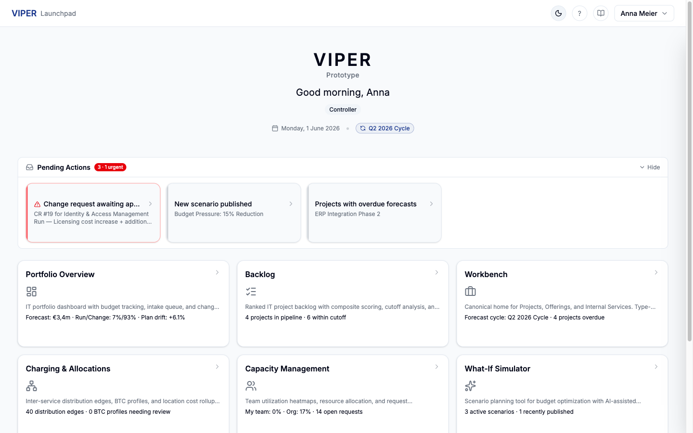
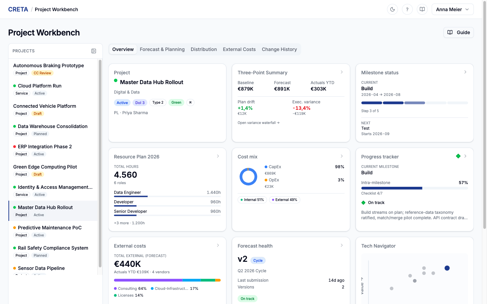
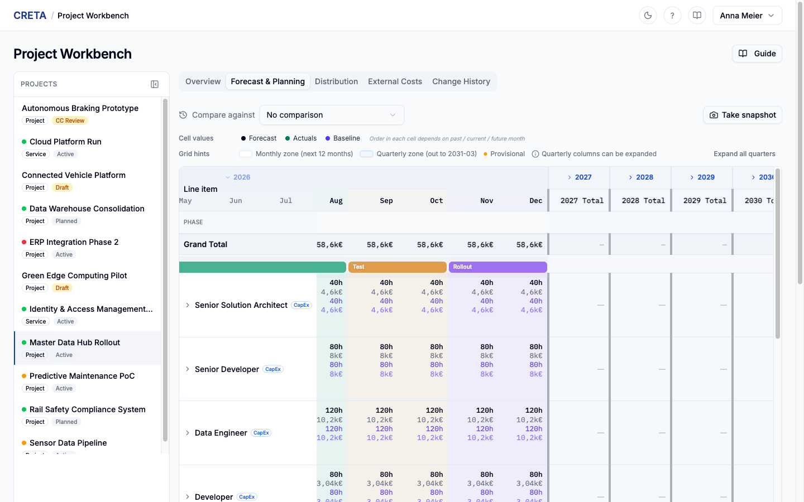
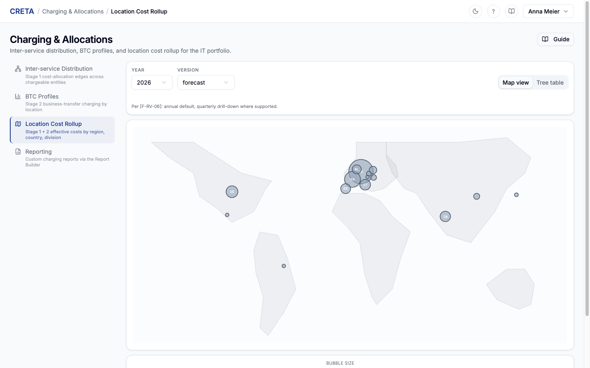

# CRETA

**Controlling, Reporting, Estimation, Tracking & Allocations**

CRETA is a working demo of an end-to-end IT financial planning and portfolio management application. It covers the full controller's life-cycle — intake, ranking, planning, forecasting, capacity, charging, scenario analysis, and reporting — for an IT organisation that runs a mix of transformation projects, productised offerings, and internal services.

> This is a **demo** with realistic, hand-curated mock data. It is not connected to any production system, and it can be reset to its initial state at any time.

---

## A quick look

<p align="center">
  
  <br><em>Launchpad — persona greeting, pending actions, and a 3-column module-card grid with role-aware KPIs</em>
</p>

<p align="center">
  
  <br><em>Project Workbench — Overview tab with three-point summary, milestones, resource plan, cost mix, progress tracker, and Tech Navigator tiles</em>
</p>

<p align="center">
  
  <br><em>Forecast &amp; Planning — mixed-granularity grid (monthly inner zone, quarterly outer zone) with milestone phase tinting and Baseline / Forecast / Actuals stacked in each cell</em>
</p>

<p align="center">
  
  <br><em>Charging &amp; Allocations — world map of location costs, drillable from country down to individual charging-location bubbles</em>
</p>

---

## What's inside

CRETA is organised as ten modules. They share a left-rail navigation, a role-aware top bar, and a configurable n-level portfolio hierarchy.

### Launchpad
The home screen. A persona-aware greeting, the current date and forecast cycle status, a horizontal pending-actions strip (urgent items first), and a fixed 3-column **module-card grid** that doubles as the primary navigation entry. Each card carries a one-line description and 1–2 live KPIs computed for your role — the Workbench card, for example, reads "Forecast cycle: Q2 2026 Cycle · 4 projects overdue" for a Controller and "Your 5 projects" for a Project Lead. Cards you don't have access to are hidden entirely rather than greyed.

### Portfolio Overview
A two-pillar dashboard reflecting how the IT organisation actually runs:

- **Change Portfolio** — transformation projects with a KPI strip (forecast, run-vs-change split, plan drift), a configurable hierarchy tree (Line of Business → Programme → Project, but the levels are admin-editable), RAG indicators, an intake queue with controller approve / reject / send-back actions, a change request approval queue with editable grids and side-by-side diff, and an External Spend tab for cross-project vendor and category analysis.
- **Run Portfolio** — productised offerings and internal services with annual-cost KPIs, a To-Business vs internal split, mix by entity type, an outsourcing ratio, region / division / country rollup panels, and a type-filtered entity list that drills into a slim entity workspace.

A pill switcher at the top of the module flips between the two pillars; the chosen view is remembered across sessions. Clicking any project from either view opens a full-page detail with a hierarchy breadcrumb and four tabs: Overview, Financial Detail, Resources & Costs, History.

### Backlog
Ranked demand pipeline with a composite scoring model. Each project is scored on three Complexity sub-criteria (Standardisation, Usage, Maintenance) and three Value Creation sub-criteria (Financial Benefit, Payback, Competitive Advantage), each on a 1–5 scale. Weights are admin-configurable and feed a single composite ranking.

Two views: a **Ranked List** with cutoff bands inserted at the budget-envelope cutoff and the reality-cutoff line, and a **Cube view** of three scatter charts grouped by transformation level (Just better / Paper to software / New business) with bubble size proportional to budget. A budget-envelope KPI strip stays visible across both views. Clicking into a project opens a four-tab detail: Scores & Ranking (rubric editor), Financial Overview, Master Data (with a degree-of-implementation completeness checklist), and Milestones.

### Project Workbench
The day-to-day project workspace. A sidebar lists the projects you have access to; the main pane shows five tabs:

- **Overview** — a 3×3 tile grid summarising project health: header, three-point summary (Baseline / Forecast / Actuals YTD with plan drift and execution variance), milestones, resource plan, cost mix (CapEx / OpEx donut + internal / external split), progress tracker (current milestone, deliverable checklist, confidence indicator, narrative), external costs, forecast health, and Tech Navigator scoring. Dialogs open from the tiles for a Variance Waterfall (baseline → grouped CR categories → current forecast) and a Progress vs Burn chart.
- **Forecast & Planning** — a mixed-granularity grid (monthly inner zone, quarterly outer zone, with a visible granularity boundary) showing Baseline / Forecast / Actuals stacked in each cell. Year columns collapse and expand; milestone phases tint the column backgrounds; a comparison chart sits below the grid in lockstep horizontal scroll. A 5-phase rolling forecast wizard handles the cycle submission workflow.
- **External Costs** — a vendor-by-month grid with stacked Forecast / Actuals / Accrual / PO-Obligo cells, procurement-status badges, sticky-right metadata (Role, PO #, Contract end, Status, Open PO), a 6-up KPI strip, and row expansion that shows delivery schedule + invoice history side by side.
- **Cost Allocation** (or **Distribution** when an entity has zero to-business share) — embeds the BTC profile editor for the project's chargeable entity, a sortable allocation breakdown table with click-to-drill into upstream cost paths, and an audit history.
- **Change History** — every approved change request and every cycle close becomes an immutable forecast version; this tab compares any two versions side by side.

### Capacity Management
Unified scope-driven workspace (v5.2 W3 + W4 + W5 + W6). The **Workspace** at `/capacity` renders a person-centric stacked-bar timeline with a collapsible year/quarter/month axis, project-colored segments, and over-allocation borders; a 5-card KPI summary bar (Headcount / Avg utilization / Over-allocated / Pending requests / Supply gap) drives smart filter chips (All / Over-allocated / Under-utilized / Pending requests / Unassigned months) with live count badges; a sticky-bottom demand-vs-supply strip shows unfulfilled-request pressure per period. Clicking a person row opens a 280px side panel (`PersonDetail`) with their allocations, monthly utilization summary, and pending-request entry points. Controllers and Executives at multi-CC scope (All-CCs / per-Location / per-hierarchy-node) see a collapsible **Capacity Dashboard** layer with four cards: utilization distribution histogram (six buckets), capacity forecast time-series (available / allocated / demand with green-surplus / red-deficit gap shading), headcount breakdown stacked bar (switchable across Location / Hierarchy / Role / CC), and a top-5 hotspot list spanning over-allocation, unfulfilled-demand, and chronic under-utilization (v5.2 W4). The dashboard auto-hides when scope narrows to a single CC. CC Owners triage requests by clicking **Review & assign** on a project-per-CC row; the workspace deep-links via `?assignment_project=…&cc=…` and opens a 400px assignment panel with project header, completion progress (shown as `N full · N partial · N unassigned` per spec §9.5), per-role sections (collapsible, with quick-fill bulk assignment), per-month assignment slots with person picker, and an action bar for Save Draft / Confirm / Decline. CR re-confirmations show inline diffs (blue increase / orange decrease) and pre-fill unchanged months. **Timeline ghost overlay (v5.2 W5)** — while assignment mode is active the timeline overlays dashed-border *ghost segments* on candidate person bars: 30% opacity / 1.5px dashed in the project's color for matching-role candidates, 15% opacity / 1px for fallback candidates; red border previews over-allocation; blue / orange borders mark CR increase / decrease months. Clicking a ghost assigns that person for the full remaining hours; clicking a just-assigned solid block reverts the gesture. Role groups containing matching candidates auto-expand on session entry. Beyond the inbox URL deep-link, two additional entry points open the same assignment session: the person-detail panel's **Review project** button on a pending-request card, and a click on an **Unfulfilled-demand strip cell** which opens a side panel listing pending projects with `Review project` CTAs. **Multi-person month splits (v5.2 W5)** — any month row supports a **+ Add** action that opens an hours-input variant of the picker pre-filled with the remaining hours; multiple people can split a single month with hours summing to the request total (rebalanced automatically when a typed value would over-commit), partial months are permitted and show a `Nh remaining` indicator, and the action bar offers **Confirm partial & send to controller** when partials exist. The **Resource Requests** queue at `/capacity/requests` shows a project-per-CC triage table with role badges, unassigned hours, age, priority, and status (new / in-progress / re-confirm); CR-triggered re-confirmations carry a distinct blue pill. A collapsible **Recently completed** section surfaces the user's actions over the last 7 days with action-type badges (Confirmed / Partial / Declined / Declined request / Re-confirmed). The **History** page at `/capacity/history` is a chronological audit trail with filters (acting user / action type / cost center / date range / project) and expandable detail-payload rows; capacity actions log six action types per spec §12.10 (`confirm`, `partial_confirm`, `decline`, `decline_request`, `assign_draft`, `cr_reconfirm`) with `partial_confirm` emitted automatically by the project-level confirm endpoint when any month's per-person sum is below the requested hours. Project Leads see a privacy-preserving **Resource Availability** view at `/capacity/availability` (v5.2 W4) — role-level capacity bars with two-layer fill (allocated / available), `⚡N` competing-demand badges, monthly breakdown side panel, location comparison, and a "Request this role" CTA into the Workbench. Person, project, and CC names are never exposed. **Cross-cutting integration & polish (v5.2 W6)** — every dashboard chart click is wired end-to-end: utilization-distribution buckets activate the matching filter chip on the timeline, capacity-forecast month bars expand the containing quarter and scroll the timeline to that column (per spec §11.4), headcount-breakdown segments push a scope change, and hotspot rows open the side panel; spec §10.8 cache-miss fallback now lets `ProjectSummaryPanel` resolve deep-linked projects that aren't in the workspace's current scope; the legacy `/capacity/project-assignment/{pid}` deprecation redirect preserves `cc` / `cr` query params and pins `scope=my_cc` so external bookmarks land cleanly inside the workspace; a new **Workbench → "Check availability" slide-over** (spec §13.9) lets PLs open the role-availability grid as a 50%-viewport drawer from the Forecast & Planning tab — selecting a slot closes the drawer and populates the F&P request banner with role / location / suggested period; SidePanel now closes on Escape, supports the `aria-pressed` state on FilterChipBar, and transitions smoothly between the 280px / 400px widths used across capacity panels.

### What-If Simulator
Scenario planning with a multi-tier action catalogue. Scenarios anchor against a specific forecast version rather than rebasing automatically. Tier 1 levers cover forecast grid edits, pipeline transitions, milestone slides, and cost reallocation; Tier 2 covers rate-table and Tech Navigator overrides; Tier 3 covers people / capacity-parameter / restructuring scenarios and is gated by an explicit visibility flag.

The flagship lever rebalances the Stage-2 BTC profile across charging locations: edits stay in a sandbox (Stage 1 distribution edges fork into a scenario-scoped `DistributionVersion` discriminated by `scenario_id`, anchored to a pinned production version at scenario creation so reactivations don't shift impact deltas mid-flight; BTC line edits live as overlays on the scenario rather than mutating canonical rows) until you explicitly **Promote**, which routes each diff through its native system path (forecast grid → direct or change request, pipeline → DoI gate, rate table → admin path, etc.). An 8-dimension impact dashboard (financial, backlog ranking, capacity, people, outsourcing ratio, investment mix, running cost, change summary) updates live as the scenario is edited. Project Leads have an **Apply-to-forecast** action that carries their own-project diffs into the next forecast cycle as provisional cells.

An optional AI Advisor panel surfaces optimisation recommendations using natural-language reasoning over the scenario state.

### Charging & Allocations
Two-stage IT cost flow with a polymorphic chargeable-entity model — the same machinery handles a Project, a productised Offering, or an Internal Service. Four primary surfaces in a left-rail layout:

- **Inter-service Distribution (Stage 1)** — sparse percentage edges between chargeable entities, organised into **effective-dated `DistributionVersion`** headers (FD-3, spec §4): each version is a draft/active state machine carrying a version-level rationale and a creation origin (blank / copy-active / copy-prior), with optional per-edge rationale. Resolution is purely by effective date — `in_force_version = max(active_from where active_from ≤ evaluated_date)` — with cadence-agnostic activation (no yearly assumption). Future-dated versions stay dormant until their `active_from`. A version diff report compares two versions edge-by-edge (added / removed / changed with old→new % + rationale deltas), defaulting to vs prior-by-effective-date. Per-entity Stage 1 surface renders a single entity's outbound edges, to-business %, self-retained residual, effective cost, and version timeline. The DAG resolver returns an effective cost per entity (own cost + sum of inflows). Save is blocked on cycle creation, with the cycle chain returned in the error body so the UI can render it. Active versions are immutable; edits scope to drafts only. Scenario forks (lever 12) are first-class versions discriminated by `scenario_id`, excluded from production resolution, and pinned to the production anchor at scenario creation so impact deltas don't shift mid-flight.
- **BTC Profiles** — per-entity Business-Transfer-Charging splits across charging locations. Manual mode is a hand-authored line list with a sum-to-100 gate; automatic mode snapshots from the User Measurement matrix for a chosen S-code, with a Refresh-from-UM diff dialog before commit. A bulk year-rollover dialog scopes by All / By type / Specific entities for annual planning kickoff.
- **Location Cost Rollup** — a static SVG world map with country bubbles (size = magnitude, colour = dominant division) that drill into per-location bubbles, then into a side panel with the location's chargeable-entity inflows and the legal entities operating there. A tree-table view offers three pre-built rollup paths (Region → Country → Location, Division → Location, Country → Location) with cell drill-down to contributing entities and DAG upstream chains.
- **Reporting bridge** — quick-prompt buttons jump into the AI Report Builder with pre-filled prompts for cost-by-division, top-inflow-drivers, and regional year-over-year analyses.

WBS Element strings are **algorithmic, never stored** — generated at request time as `<identifier>-64-99-<charging_location_code>`.

### Reporting
Five standard reports with configurable groupings, column choices, saved views, and CSV / Excel export:

1. Programme Rollup
2. Cost Centre Financial Summary
3. Vendor Spend Analysis
4. Forecast Accuracy
5. Year-over-Year Comparison

Two additional report-building surfaces:

- **Interactive Report Builder** — click-to-build OLAP-style composer with a 18-dimension / 16-measure data catalogue. Drag dimensions into Rows / Columns / Filters, drop measures into Values, and watch a cross-tab table with collapsible row groups, subtotals, grand totals, sticky headers, conditional formatting (RAG presets), and four chart views (Table / Bar / Line / Pie). Calculated measures support two-operand formulas. Reports save, share with permission controls, and publish to a Report Library for team access.
- **AI Report Builder** — natural-language report generation. Describe a report in plain English through a guided chat interface; the assistant queries the database and renders tables, charts, and KPI summary cards. Iterative refinement happens through follow-up messages. Requires an Anthropic API key configurable in Administration → Planning Parameters → Integrations.

### Administration
Five-section sidebar navigation covering 24 admin sub-surfaces:

- **Master Data** — Cost Centres, Competence Centres, Lines of Business, Workforce Locations, People, Charging Locations, Legal Entities, Regions, Countries, User Measurement matrix.
- **Reference Catalogues** — Role Types, External Cost Types, Project Dependencies.
- **Planning & Ranking** — Rate Tables (with effective dates so historical cost calculations are accurate), Tech Navigator weight + threshold editor.
- **Portfolio Hierarchy** — configurable n-level node graph editor; controllers add or rename levels (e.g. "insert a Department level above LoB") without code changes.
- **System** — Users (with Tier 3 + change-reviewer flags), Role Permissions Grid (per-role per-entity-type grants for BTC profile / distribution / master-data overrides), Workflow Templates (six configurable workflows with per-step touchpoint editor), Scheduled Changes (a 5-state pending-review → activated lifecycle with a manual-trigger activation engine), Audit Log V2 (8 categories with entity-scoped trail and CSV / Excel export), Planning Parameters.

Deactivation (`is_active` flags) is used everywhere instead of deletion so historical reports keep their references intact.

### Documentation Hub
In-app `/docs` route with six tabs:

- **Overview** — what each module does, at a glance.
- **Module Guides** — one manual per module with an Overview, key workflows, and tips.
- **API Reference** — live OpenAPI groupings with try-it-out forms.
- **Data Model** — entity reference grouped by domain (Organisation & People, Projects & Financials, Charging & Allocations, Scenarios, Workflow & System).
- **FAQ** — 40+ task-oriented Q&As, role-filtered.
- **Changelog** — release notes for demo storytelling.

---

## Cross-cutting features

- **Four personas, one app.** A role switcher in the top bar lets you experience the same data through Controller, Project Lead, Cost Centre Owner, or Executive eyes. Permissions, default modules, and KPI framings adapt automatically.
- **Dark mode.** Sun / moon toggle in the top bar; both themes are first-class. Theme preference persists in localStorage and respects the OS preference on first load.
- **European number formatting** throughout (dot for thousands, comma for decimals — `€14.400,00`).
- **Server-side computation.** The frontend receives ready-to-render rows; no roll-ups or calculations happen in the browser.
- **Configurable hierarchy.** The portfolio tree is a node graph, not hard-coded tables — admins reshape the organisation without a deploy.
- **Versioned forecasts.** Every approved change request and every cycle close creates an immutable snapshot; any two versions can be compared side by side.

---

## Quick Start

### Prerequisites

| Tool | Version | macOS install | Windows install |
|------|---------|---------------|-----------------|
| Python | 3.12+ | `brew install python@3.12` or [python.org](https://www.python.org/downloads/macos/) | [python.org installer](https://www.python.org/downloads/windows/) — tick **"Add python.exe to PATH"** |
| Node.js | 20 LTS+ | `brew install node@20` or [nodejs.org](https://nodejs.org) | [nodejs.org installer](https://nodejs.org) (or `winget install OpenJS.NodeJS.LTS`) |
| Git | any recent | preinstalled / `brew install git` | [git-scm.com](https://git-scm.com) — also installs **Git Bash**, needed to run `start.sh` |

### Setup — macOS / Linux

```bash
git clone https://github.com/bill-pap/vision-demo-prototype.git
cd vision-demo-prototype

# Backend
cd backend
python3.12 -m venv .venv
.venv/bin/pip install -r requirements.txt

# Frontend
cd ../frontend
npm install
```

### Setup — Windows (PowerShell)

```powershell
git clone https://github.com/bill-pap/vision-demo-prototype.git
cd vision-demo-prototype

# Backend
cd backend
py -3.12 -m venv .venv
.\.venv\Scripts\python -m pip install -r requirements.txt

# Frontend
cd ..\frontend
npm install
```

### Run

From the project root:

```bash
# macOS / Linux — runs natively
./start.sh

# Windows — run from Git Bash (ships with Git for Windows)
./start.sh
```

This starts both servers, resets demo data, and opens the app at **http://localhost:5173**.

If you'd rather not use Git Bash on Windows, open two PowerShell terminals and start each server manually — see [SETUP.md](SETUP.md) for the exact commands plus environment variables, troubleshooting, and a fresh-clone smoke test.

---

## Demo Personas

Switch personas via the role dropdown in the top-right corner. Each persona has a different default landing module, set of Launchpad cards, and write permissions.

| Persona | Role | Title | Key Access |
|---------|------|-------|------------|
| **Anna Meier** | Controller | IT Controller | Full access — every module, all admin surfaces, all approvals |
| **Priya Sharma** | Project Lead | Senior Project Lead | Workbench, forecast cycle wizard, scenarios on own projects, intake submission |
| **Thomas Brenner** | CC Owner | Head of Application Development | Capacity Management, resource confirmations, scenarios scoped to managed cost centre |
| **Dr. Klaus Weber** | Executive | VP IT Strategy & Governance | Read-only portfolio + reports, scenario creation and comparison |

---

## Tech Stack

| Layer | Technology |
|-------|-----------|
| Backend | Python 3.12 · FastAPI · SQLAlchemy ORM · Pydantic v2 |
| Frontend | React · TypeScript · Vite · Tailwind CSS |
| UI components | shadcn/ui (Radix UI primitives) |
| Charts | Recharts |
| Database | SQLite (embedded for demo) |
| Font | Inter |

---

## Project Structure

```
vision-demo-prototype/
├── backend/              # FastAPI + SQLAlchemy + SQLite
│   ├── models/           # SQLAlchemy ORM models (Project, ChargeableEntity, BTCProfile, ...)
│   ├── routers/          # Route handlers (~22 routers, 200+ endpoints)
│   ├── schemas/          # Pydantic v2 request/response schemas
│   ├── services/         # Business logic (forecast cycle, BTC, scenarios, rollup, ...)
│   ├── seed/             # seed.sql + JSON fixtures (manuals / FAQ / changelog)
│   └── tests/            # Pytest suites
├── frontend/             # React SPA
│   ├── src/modules/      # 10 module UIs
│   ├── src/components/   # Shared components (shared, layout, ui, charts)
│   └── src/contexts/     # React contexts (Theme, Role, SidePanel, BottomDrawer)
├── qa/                   # E2E test plan + visual verification artefacts
├── start.sh              # One-command launcher
├── SETUP.md              # Detailed setup guide
└── PROGRESS.md           # Build progress tracker
```

---

## Demo Context

- **Demo date:** April 2026 — all time-dependent logic (actuals cutoffs, forecast boundaries, elapsed-month tinting) keys off this date.
- **Currency:** EUR with European formatting (dot for thousands, comma for decimals).
- **Data range:** FY 2021 through FY 2029.
- **Hierarchy:** four top-level Lines of Business out of the box; admin-configurable n-level via `GroupingEntity`.
- **People:** ~52 across 10 cost centres in 3 locations (Munich, Budapest, Pune).

---

## API Documentation

Interactive Swagger UI is available at **http://localhost:8000/docs** when the backend is running. The in-app Documentation Hub at `/docs` includes a live API Reference tab with the same OpenAPI groupings.

Authentication for development is header-based: every request carries an `X-Current-User` header with a persona ID (e.g. `persona-controller`). The backend resolves it to a `CurrentUser` context and applies role-based authorisation via FastAPI dependencies. For example:

```bash
curl -H "X-Current-User: persona-controller" http://localhost:8000/api/portfolio/kpis
```

Endpoints are grouped by domain:

| Domain | Path prefix | Purpose |
|--------|-------------|---------|
| Launchpad | `/api` | Roles, modules (with role-differentiated subtitle KPIs), KPIs, pending actions, project create/submit |
| Portfolio | `/api/portfolio` | Dashboard KPIs, project tree, intake queue, change request approvals, external-cost analysis |
| Workbench | `/api/projects`, `/api/workbench` | Project list, overview, mixed-granularity forecast grid, forecast cycle, change-request diffs, version history |
| Forecast Versions | `/api/forecast` | Cross-project version diff |
| Tech Navigator | `/api/projects` | Per-project Tech Navigator profile (read + partial update with score recompute) |
| Pipeline | `/api/projects` | Pipeline stage + DoI transitions, AI Council flag, within-cutoff override |
| Project Milestones | `/api/projects` | Milestone CRUD with controller-only baseline-edit gating |
| Define (project workflow) | `/api/projects` | Define-page surface: name-only `POST /define`, full `GET /{id}/define`, per-tab Save (`PUT /{id}/identity`, `PUT /{id}/approval-milestones`, `PUT /{id}/baseline-grid`) |
| Capacity | `/api/capacity` | Heatmap, drill-down, resource requests, role availability, dashboard (forecast / headcount-breakdown / hotspots / **utilization-distribution** v5.2 W4), audit history, inbox (project-per-CC triage queue, v5.2 W3), **`GET /planning-parameters?group=…`** read-only feed for client-side display thresholds (v5.2 closeout — any persona; trimmed payload vs the controller-only `/api/admin/parameters`) |
| Scenarios | `/api/scenarios` | CRUD, actions, comparison, AI advisor, BTC sandbox, 8-dimension impact, anchor + rebase + archive, promote, apply-to-forecast |
| Reports | `/api/reports` | Five standard reports, saved views, AI report builder |
| Report Builder | `/api/report-builder` | Data catalogue, query execution, saved reports CRUD, share/publish, CSV export |
| Charging | `/api/charging`, `/api/admin` | ChargeableEntity CRUD (FD-6: allocation_key field, `chargeable-entity-types` metadata for the admin panel), **distribution versions** (effective-dated draft/active, create with blank/copy-active/copy-prior origin, activate with date + rationale, version diff, per-entity Stage 1 view) and **distribution edges** (scoped to a draft version, with per-edge rationale), **BTC profiles** (FD-4: explicit `POST /btc-profiles/{id}/activate` freezes `um_snapshot_at` against the currently-active UM version; InternalService BTC is derivation-only — manual mode rejected by service + UI), **`GET /sap-export`** (FD-4: JSON/CSV; column-normalised % per service per charging location, WBS synthesised from active versions), **`/api/charging/user-measurement/*`** (FD-2: relocated from `/api/admin/user-measurement` — versions list/create with blank/copy_active/copy_prior origin, CSV draft import without auto-activate, bulk cell PATCH, activate, info reframed as system-of-record statement per `[F-DIR-01]`), rollup query, location breakdowns, WBS preview |
| Admin | `/api/admin` | Master-data CRUD, rates, planning parameters, hierarchy, audit log, demo reset |
| Docs | `/api/docs` | Module manuals, FAQ, changelog, OpenAPI proxy |
| Reference | `/api/reference` | Read-only role / cost-type / hierarchy / cost-centre catalogues |

---

## Reset Demo Data

Restore the original demo state at any time:

```bash
curl -X POST http://localhost:8000/api/admin/reset-demo
```

Or use the **Reset Demo** button in Administration. The reset is destructive (drops and recreates tables, re-runs `seed.sql`, reloads JSON fixtures) but takes only a few seconds.

---

## Quality Assurance

A regression test plan lives in [`qa/test-plan.md`](qa/test-plan.md) — 198 scenarios across 15 test suites covering all modules, personas, and features. Backend unit tests run with `python -m pytest tests/ -v` (1745 tests).
